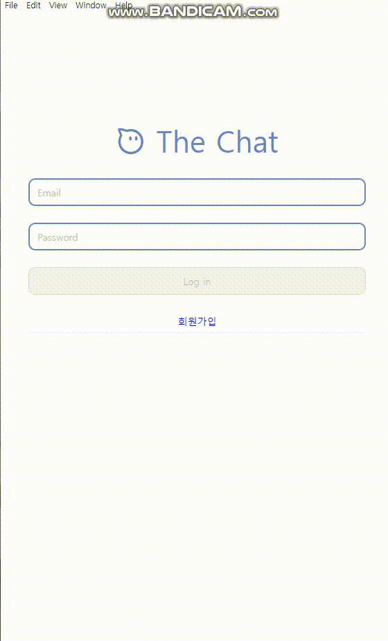
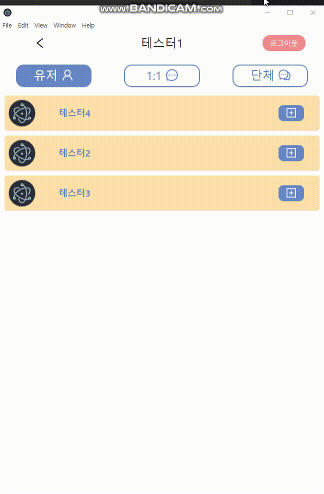
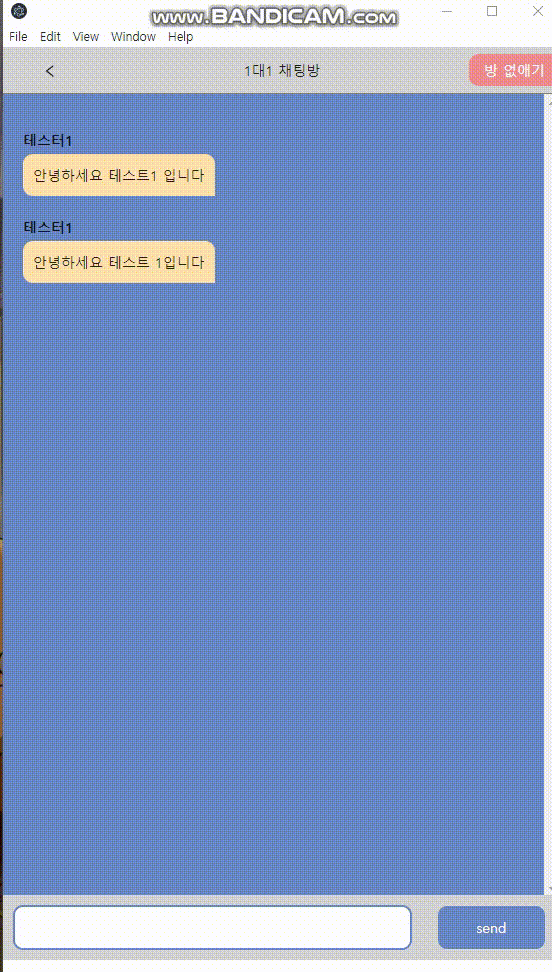
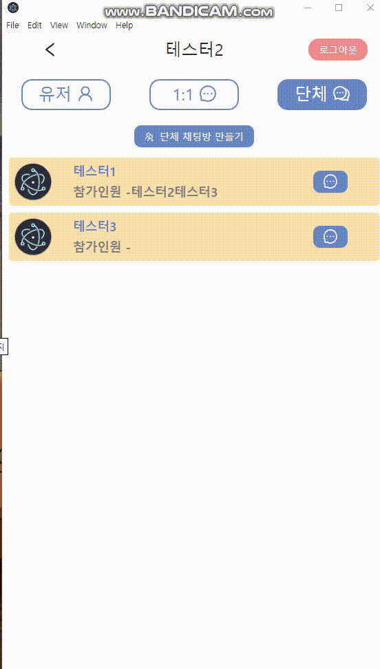
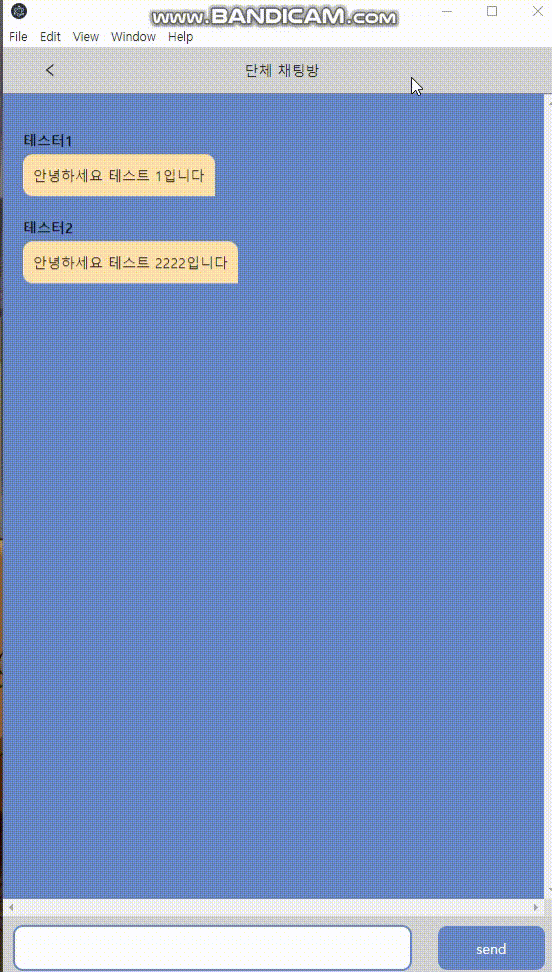
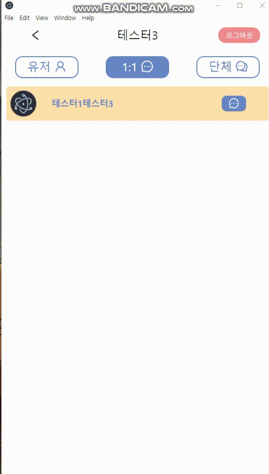
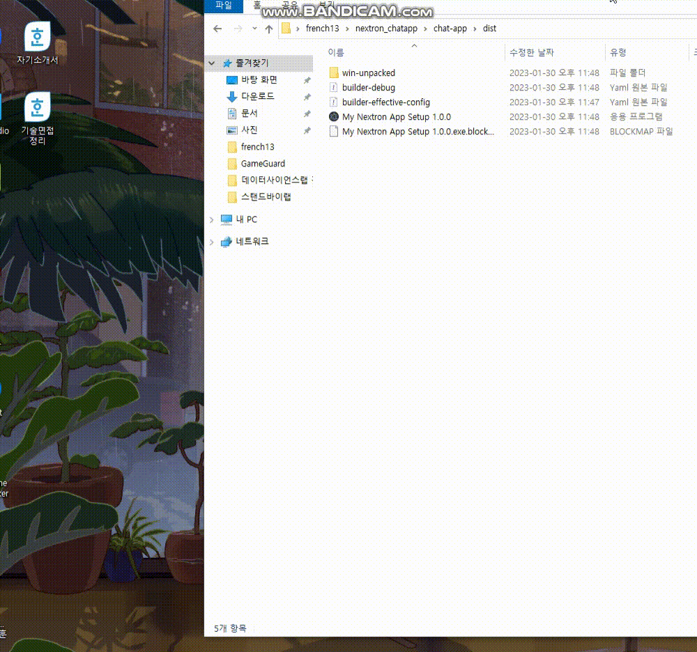

#  채팅-nextron_typescript

---
### :white_square_button: 개발 배경 (개인 프로젝트)
nextron, nextjs, typescript, firebase 채팅어플리케이션 구현 입니다. **로그인, 회원가입, 유저 불러오기, 1대1 채팅방, 단체 채팅방을 구현**하였습니다.

##### :white_square_button: 실행방법
```
git clone : https://github.com/french13/nextron_chatapp.git

$ cd chat-app
$ npm install && npm i
```

```
서버 실행 (http://localhost:8888)
$ npm run dev
```
```
build
$ npm run build   후 dist 폴더
```
```
계정
id : test1@gmail.com   pw : test1234
id : test2@gmail.com   pw : test1234
id : test3@gmail.com   pw : test1234
id : test4@gmail.com   pw : test1234
```
---
#### :hammer: 패키지
      

---

### :white_square_button: 구현

#### :one: 회원가입, 로그인
|구현화면|
|--------|
||

#### :two: 1대1 채팅방 만들기
|구현화면|채팅방 메세지|
|--------|----|
|||
- 자신의 uid와 클릭한 유저의 uid를 합쳐서 **채팅방 고유 id를 만들어서 채팅방을 생성**하였습니다.
- 만약 클릭한 유저와의 **채팅방이 존재하는 경우 생성이 되지 않게 하였습니다.**

#### :three: 단체 채팅방 만들기
|구현화면|채팅방 메세지|
|--------|------|
|||
- 생성되어진 단체 채팅방에 들어갈시 **본인의 이름이 없으면 단체 채팅방에 추가** 되게 만들었습니다.

#### :four: 채팅방 삭제하기
|구현화면|
|--------|
||


#### :five: nextron 으로 build하여 설치하기
|구현화면|
|--------|
||

---

#### :grey_exclamation: 느낀점
- 스스로 정확히 정의를 내리지 못했던 CSR, SSR의 차이를 느낄수 있었습니다. **CSR은 빌드 시 모든 파일을 하나로 합쳐서 브라우저에 보여주기 때문에 초기에 로딩화면이 나오는데 시간이 걸려 검색엔진 노출시 순위가 뒤로 밀린다는 단점이 있지만 한번 나오면 그 이후에는 빠르다는 장점**이 있고 **SSR은 페이지에 접속시 그 페이지에 해당하는 html파일을 빠르게 보여주고 뒤에 데이터를 받아오기때문에 SEO를 필요로하는 페이지를 만드는데 유리하다는 장점이 있지만 보여주기만 할뿐 작동은 안된다는 단점**이 있다는 것입니다. NextJs사용하여 페이지마다 **SSR과 CSR의 용도에 맞게 페이지를 제작을 한다면 단점**을 커버할수는 있습니다. 
- **getServerSideProps**를 사용하여 서버사이드랜더링을 구현할때 어떻게 SSR이 진행되는지 알 수 있었습니다.
- next에서의 **Link와 router.push, router.replace**의 차이를 이해할 수 있었습니다.
- nextjs를 사용하더라도 가장 중요한 것은 기본기(javascript) 라는 것을 깨달았습니다.